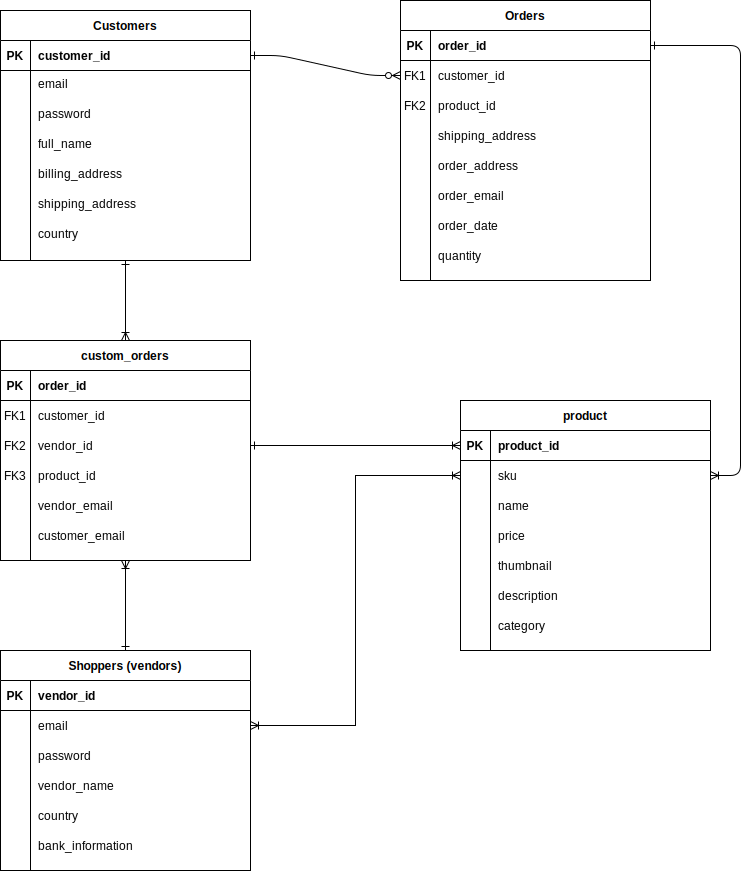

Technische Spezifikation
====

## verwendete Technologien

Um den Prozess der Konzipierung möglichst effizient zu gestalten, wird Wordpress verwendet. WordPress ist ein open-source Content Management System (**CMS**; Inhaltsverwaltungssystem) welches primär zum verwalten von Webinhalten eingesetzt wird. 

Das vorgesehene Software-Stack beinhaltet drei Erweiterungen von Wordpress: WooCommerce (**WC**), WC Frontend Manager (**WCFM**) und StoreFront. Letzteres ist eine bereits vorgefertigte und kommerziell nutzbare Vorlage für den Onlinehandel. WC und WCFM bilden das komplementäre Backend zu der Vorlage. Dadurch ist es möglich in kurzer Zeit einen komplett funktionsfähigen Prototypen zu entwickeln.
___
## Datenmodell

WordPress kann wahlweise mit MySQL oder MariaDB verbunden werden. Für die Implementierung wird eine Domain, sowie eine MySQL-Datenbank des Internetdienstanbieters Strato AG verwendet. Das Datenbankenschema entspricht in etwa der folgenden Abbildung: 

Der USP von Lumay liegt darin, dass Kunden sich mit regionalen Einkäufern austauschen können. Das bedeutet konkret, dass jeder Einkäufer seine Region definiert, sodass er von Käufern beauftragt werden kann um lokale Spezialitäten anzuschaffen. Gemeinsam einigen sich beide Parteien auf einen Preis und wickeln den Kauf sicher über Lumay ab.

Für Lumay ergibt das einen großen Datenpool mit wertvollen Kundendaten, welche für Marktforschungszwecken eingesetzt werden können. Zudem sind Kunden bereit eine marginale Gebühr für eine sichere Transaktion zu bezahlen. 
## Schnittstellen
Um möglichst viele wiederkehrende Kunden zu gewinnen ist es besonders wichtig, dass das Einkaufserlebnis möglichst effizient gestaltet wird. Über Schnittstellen soll es Verkäufern möglich sein, ihr Profil mit bspw. Google Analytics zu verbinden. Analysewerkzeuge, gepaart mit einem großen Datenpool erlaubt es Verkäufern ihre Zielgruppen genauer abzugrenzen und gezielter anzuwerben.

Hierzu sind folgende mögliche Schnittstellen denkbar:
- MySQL → Google Analytics
- MySQL → Matomo
- MySQL → CSV o.ä. für weitere Analysen

Schnittstellen zur Accountverwaltung sind nicht explizit notwendig, da das ausgewählte Software-Stack bereits diverse Lösungen zur Administration anbietet.

## Prozesse
- Registrieren
- Anmelden
- In Warenkorb
- Suchen
- Produkt anschauen
- Warenkorb anschauen
- Kaufen / Bestellen
- Produkt hinzufügen
- Blog Beitrag erstellen (von Admins)

## Komponenten
- Rechtliche Seiten
- Blog
- Landing Page
- Shop + Produktkatalog
- Warenkorb + Bestellen
- Nutzermanagement

## Prozesse und Komponenten (von Marie)
Um einen schnellen und einfachen Überblick über die Webseite zu erhalten, können die verschiedenen Komponenten betrachtet werden. Hierbei stehen vor Allem die Landing Page als Aushänger und den Shop mit dem Produktkatalog im Vordergrund. Aufgrund der Tatsache, dass es sich um einen Onlineshop handelt, stellen diese beide Komponenten den Grundstein der Webseite da. Zu diesem Konstrukt gehört auch der Bestellvorgang, welcher aus dem Warenkorb und der eigentlichen Bestellung mit Kaufabschluss besteht. Zusätzlich dazu beinhaltet die Webseite auch die Möglichkeit einen Blogbeitrag zu erstellen. Vorerst ist das jedoch nur den Administratoren als Privileg vorenthalten, um den Kunden die Welt, aus der die angebotenen Produkte stammen, näher zu bringen und den Onlineshop somit auch mit Informationen auf zu werten. Neben diesen prozessrelevanten Komponenten sind auch rechtliche Seiten und das Nutzermanagement von Nöten, um die Webseite zu vervollständigen.

Die Grundbausteine des Onlineshops bauen auf den dazu benötigten fundamentalen Prozessen auf:

* Registrieren
* Anmelden
* In Warenkorb
* Suchen
* Produkt anschauen
* Warenkorb anschauen
* Kaufen / Bestellen
* Produkt hinzufügen
* Blog Beitrag erstellen 

